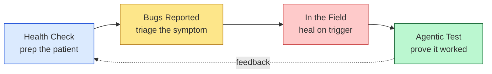
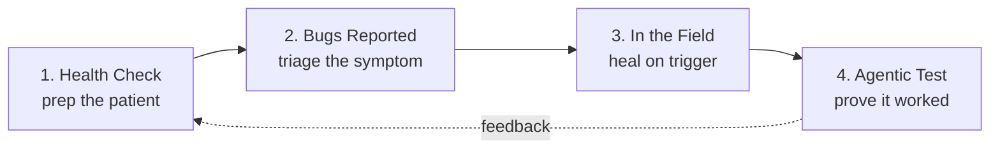
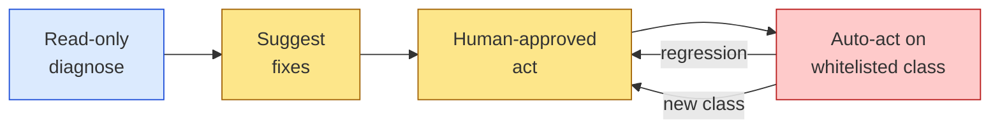
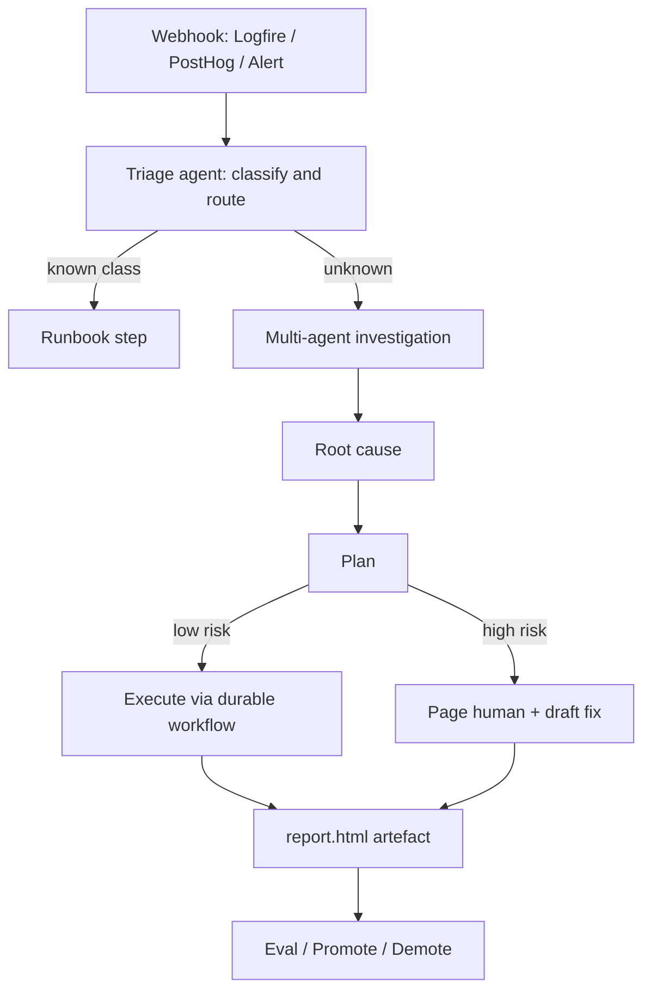
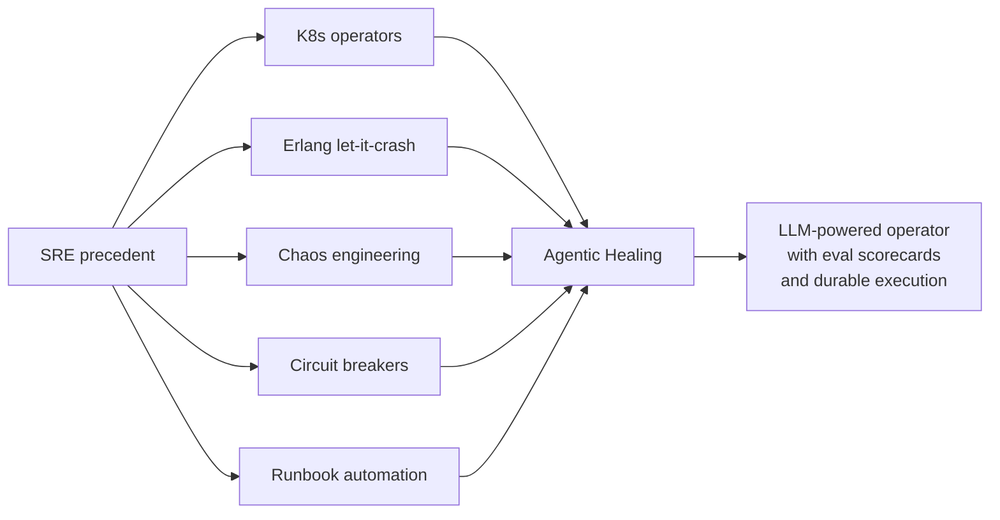
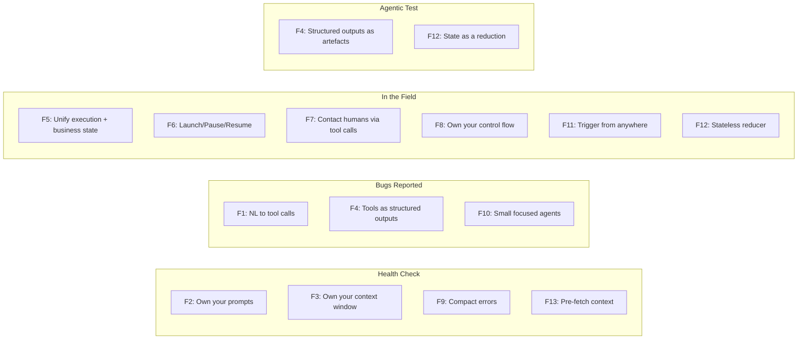

# Agentic Healing in Production — Research & Slide Guide

**Speaker:** Jack McNicol (SuperIT / Sparky)
**Event:** AI Engineer Melbourne, Web Directions, Federation Square — June 2026
**Format:** 18 minutes, separate Q&A
**Audience:** Software engineers (with SREs and AI engineers in the room)

---

## How to read this document

This guide follows your outline section by section. For each section you get:
- **Slide notes** — what's on the screen, what you say, timing
- **Research backing** — the evidence, war stories, and quotes to pull from
- **Demo / artefact** — what to show, recorded or live
- **The bridge** — the SRE precedent that gives the section credibility with engineers

Total budget: **18 minutes**. Target ~2,200–2,500 spoken words. Plan ~18–22 content slides plus title cards.

---

## The spine of the talk

**The narrative arc you're selling:** Self-healing systems aren't new — Kubernetes operators, Erlang supervisors, Chaos Monkey have been doing it for years. What's new is that the loops can now be closed by reasoning agents. But to earn that autonomy, you need to do the boring work first: prep the codebase so the agent can navigate it, triage well so it solves the right problem, heal with bounded blast radius, and *prove* every fix worked.

**One-line pitch:** *"Before you let an agent operate on your code, you brush its teeth first."*

---

## INTRO — The Dentist Story (1:30)

### Slide notes

**Slide 1 — Title card.** "Agentic Healing in Production." Your name, SuperIT/Sparky.

**Slide 2 — A photo / sketch.** Dental hygienist tools. No title.

**The story (spoken, ~60 seconds):**

> "Quick question. Before you go to the dentist — what do you do? You brush your teeth. Maybe floss for the first time in six months. You pre-clean.
>
> Why? Because you know that the better the state of your mouth when you walk in, the better the work the dentist can do. The cleaner the environment, the more focused their attention can be on what actually matters — the cavities, not the plaque.
>
> Every time I deploy an AI agent into a codebase, I think about that. Because agents are dentists. And most of our codebases are people who haven't flossed in years."

**Why this works:** It's specific, embodied, low-jargon, and it sets up the rest of the talk. The dental hygiene metaphor will carry you through every section — health check, triage, fillings (in-the-field fixes), and X-rays (agentic test).

**Slide 3 — The four stages.** Show the Mermaid spine diagram above. Promise: "Four sections, ~3.5 minutes each. For each one I'll show you what works in production, what breaks, and the SRE pattern it's built on."

### Research backing for the framing

The arc moves from **reactive → proactive** and from **AI suggests → AI acts**, with blast radius widening at each step. Trust is earned stage by stage. This framing is borrowed from the agentic SRE community (incident.io, Cleric, Datadog Bits AI), but the dental metaphor is your own — keep it.

---

## SECTION 1 — Agentic Health Check (3:30)

> *"You don't deploy an agent into a codebase. You deploy it into an environment. The environment includes the code, the history of past sessions, the CI signal, and the merge process. Heal that environment first."*

> 🧭 **12-Factor anchors:** F2 (Own your prompts), F3 (Own your context window), F9 (Compact errors), F13 (Pre-fetch context). See appendix.

### Slide notes

**Slide 4 — Header.** "Agentic Health Check." Subtitle: *"Brush the teeth."*

**Slide 5 — Change the repo so the agent flows.**

Talking points (60s):
- An agent walks into a 200K-line repo with no `AGENTS.md`, deeply nested folders, ambiguous module names, dead code from 2019. It will get lost. It will burn context.
- The fix is unglamorous: clear file naming, top-level `AGENTS.md` / `CLAUDE.md` describing how the code is organised and *how to navigate it*, examples of "good" PRs in a `docs/agent-examples/` folder, README per package.
- Concrete pattern from Anthropic's own Claude Code team (Thariq): start projects by deleting your `AGENTS.md` and rebuilding it from scratch every few weeks based on what the agent kept getting wrong.

**The deep cut:** [Dex Horthy's "No Vibes Allowed" talk at AI Engineer World's Fair 2025](https://www.youtube.com/watch?v=rmvDxxNubIg) frames this as **context engineering** — formalised as Factor 3 in his [12-Factor Agents](https://github.com/humanlayer/12-factor-agents) (see appendix). Quote you can drop:

> *"As context usage grows, model quality degrades. Empirically, this often begins around ~40% of the context window. This region is referred to as the dumb zone."* — Dex Horthy

The repo prep is what keeps the agent out of the dumb zone.

**Slide 6 — Analyse previous sessions.**

Talking points (45s):
- Treat agent transcripts as evals data. Where did it go off-track? Where did it loop? Where did it ignore an existing helper and reinvent the same util?
- Output of the analysis is a set of **repo edits** that prevent the same failure next time. Add a docstring. Rename a function. Pin an example into AGENTS.md.
- This is the "show me recommendations to help the agent reach its goal faster" bullet from your outline — but it's not the agent recommending; it's *you reading the agent's failure traces*.
- Reference: Hamel Husain & Shreya Shankar's [Evals FAQ](https://hamel.dev/blog/posts/evals-faq/) — *"60-80% of our development time on error analysis and evaluation. Expect most of your effort to go toward understanding failures (i.e. looking at data) rather than building automated checks."*

**Slide 7 — Warnings are errors.**

Talking points (30s):
- Agents read your compiler output. If half the lines are warnings, the agent learns warnings don't matter. So it'll happily generate warnings of its own. Tighten the signal.
- `-Werror` in C/C++. `noUnusedLocals`, `noImplicitAny` in TS. Linter on max. Failed CI on any warning.
- The agent is now reading a much cleaner signal — and so is the human reviewer.

**Slide 8 — GitHub merge queue.**

Talking points (45s):
- Agents will open many concurrent PRs. Without a merge queue, you get the rebase tax — agent #2's "passing CI" was against a tree that no longer exists.
- GitHub merge queue serialises the rebase + test step. Each PR is tested against the exact tree it'll merge into. No more "passed CI, broke main."
- Bonus: the queue exposes a single chokepoint where you can run heavier checks (security scan, dependency audit, type-check at full strictness) without slowing every push.

### Research backing

- **The Operator pattern** (Kubernetes/CoreOS, 2016) is the SRE precedent: codified human ops knowledge as software watching desired-state. Your repo prep is the same idea — codify what humans know about navigating *this* codebase so the agent inherits it.
- **Renovate / Dependabot** are the deterministic ancestors of agent maintenance. Dependabot doesn't "understand" your code; it just keeps the floor swept. The agent layer goes on top.
- **GitHub merge queue** documentation: https://docs.github.com/en/repositories/configuring-branches-and-merges-in-your-repository/configuring-pull-request-merges/managing-a-merge-queue

### Demo / artefact

Show one screenshot: a before/after of an `AGENTS.md`. Before: empty or one line. After: a paragraph per module, plus 3 "do" and 3 "don't" patterns. Land the point: *this took 30 minutes; it saved hours per agent session.*

---

## SECTION 2 — Bugs Reported (3:30)

> *"The X-ray comes before the filling. Triage well, or the agent will go fix something that isn't broken."*

> 🧭 **12-Factor anchors:** F1 (NL → tool calls), F4 (Tools as structured outputs), F10 (Small focused agents). See appendix.

### Slide notes

**Slide 9 — Header.** "Bugs Reported." Subtitle: *"Triage with intent."*

**Slide 10 — Unassigned → AI triage.**

Talking points (60s):
- The bug lands in the "Unassigned" lane of Linear (or Jira). It's a four-line description and a screenshot. Pre-agent: someone has to read it, find similar issues, label it, route it. Post-agent: an agent does the first pass.
- **Linear Triage Intelligence** (GPT-5 / Gemini 2.5 Pro under the hood) suggests assignee, team, labels, project. Optionally auto-applies per team. Surfaces a "thinking panel" so humans can see *why*. ([How Linear built Triage Intelligence](https://linear.app/now/how-we-built-triage-intelligence))
- **Atlassian Rovo Service Triage agent** is the Jira equivalent. PagerDuty's H2 2025 release added an **SRE Agent** doing the same for alerts.
- The win is not "AI does triage." The win is **the agent shows its work**. Linear's thinking panel is the pattern — humans intervene on the reasoning, not just the output.

**Slide 11 — Discovery: Logfire.**

Talking points (45s):
- The triage agent's hypothesis is only as good as the telemetry it can read.
- [Pydantic Logfire](https://pydantic.dev/logfire) gives an LLM-readable trace of every request, every span, every exception, with structured payload. SQL queries over your traces. Built-in OTel.
- The pattern: agent pulls the last N traces matching the user's complaint, hypothesises a root cause, opens a draft PR or asks a clarifying question on the ticket.
- Sparky angle: when a customer's MSP help desk pings about "the email isn't sending," Sparky pulls the Logfire trace of that user's session and identifies the failed SMTP handshake before a human looks.

**Slide 12 — Review with skills.**

Talking points (45s):
- A "skill" is a reusable, well-documented agent procedure: input → check list → output format. Anthropic's [Claude Skills](https://www.anthropic.com/news/skills) made this a first-class concept; the same idea exists as MCP servers, slash commands, Cursor rules.
- Triage benefits massively from skills. Instead of "look at this bug," the prompt becomes "run the `triage-bug` skill" → which has a checklist: similar issues? reproducible? severity? affected customers? owner team?
- Cheap deterministic rules first (regex on stack traces, exact-match dedup), LLM only when ambiguous. Saves tokens; avoids hallucinated routing.

### Research backing

- **Alertmanager grouping / inhibition** is the pre-LLM ancestor. Same job, deterministic rules.
- **PagerDuty Event Orchestration** added paused notifications "to give machines a chance to auto-remediate before notifying responders" ([source](https://www.pagerduty.com/platform/automation/)). The pattern matters: don't wake the human until the agent has had a swing.
- [Linear: "How we built Triage Intelligence"](https://linear.app/now/how-we-built-triage-intelligence) — the "thinking panel" UX is the most copyable pattern in the talk.
- Datadog Bits AI SRE GA'd December 2025; runs hypothesis-driven loops across logs/metrics/traces.

### Demo / artefact

Pre-record ~30 seconds: a fresh Linear ticket appearing in Triage → suggestion overlay populating in real time → the "thinking" reasoning expanding → human one-clicks accept. End with a number from your own data: *"On Sparky's intake, 80% of auto-suggestions are accepted as-is."* (Use your real number.)

---

## SECTION 3 — In the Field (4:30)

> *"This is where the agent stops suggesting and starts acting. Bound the blast radius, or it'll take the patient with it."*

> 🧭 **12-Factor anchors:** F5 (Unify execution + business state), F6 (Launch/Pause/Resume), F7 (Contact humans via tool calls), F8 (Own your control flow), F11 (Trigger from anywhere), F12 (Stateless reducer). See appendix.

This is your biggest section and your hero demo lives here. Three sub-themes: **PR actions, Recurring, Webhooks** — plus the project-manager outer loop.

### Slide notes

**Slide 13 — Header.** "In the Field." Subtitle: *"AI suggests → AI acts."*

**Slide 14 — PR actions.**

Talking points (60s):
- The PR is the *guardrail*. Branch, review, CI. You can let agents run wild here because the human gate is right there.
- **Greptile** — AI code review with codebase-wide context, posts comments on the PR. Catches the regression the human reviewer would have missed because they don't remember the helper in `utils/legacy.ts`.
- **Cursor BugBot** — security/correctness review on every PR. Pattern-matches against common vuln classes.
- **Claude Code Review** (`anthropics/claude-code-action@v1`) — drop into GitHub Actions on `pull_request`, get a senior-engineer review with full repo context. Use the Claude review *as input to* a follow-up Claude `fix` PR — close the loop.
- The pattern is to stack reviewers, not replace them. Greptile catches one class; Cursor catches another; Claude catches the architecture; the human catches the taste.

**Slide 15 — Recurring.**

Talking points (45s):
- Cron-style agents. Lowest urgency, widest blast radius — because they run unattended.
- **Dependabot / Renovate** — the deterministic floor. Every team should have this on, full stop.
- **Security scans** — scheduled SAST, dependency CVE checks. Snyk, GitHub Advanced Security, or your in-house equivalent.
- **Claude Code `/schedule`** ([docs](https://code.claude.com/docs/en/scheduled-tasks)) — the agentic layer on top. Pattern: weekly "find the worst Sentry issue and open a draft PR with a candidate fix." (Thariq from the Claude Code team recommends this exact pattern publicly.)
- **Read-only first.** A scheduled agent that posts a Markdown report to Slack is safe. One that opens PRs is the next rung. One that auto-merges them is the last.

**Slide 16 — Webhooks: observability → RCA.**

Talking points (45s):
- This is the "heal on trigger" model. Production event fires → webhook → agent investigates → posts findings (and optionally takes action).
- **Logfire → RCA** — exception with high-priority tag fires the agent. Agent pulls the surrounding trace, last 24h of related spans, recent deploys, opens an investigation. Posts to Slack within 1–2 minutes.
- **PostHog → RCA** — anomaly in funnel completion fires the agent. Agent correlates with feature flag changes, recent deploys, error rates.
- This is the **incident.io pattern**: parallel "searcher" sub-agents fan out across GitHub PRs, historical incidents, Slack, observability. Per the [ZenML LLMOps case study](https://www.zenml.io/llmops-database/ai-powered-incident-response-system-with-multi-agent-investigation): *"the system automatically creates investigations that run parallel searches, generate findings, formulate hypotheses, ask clarifying questions through sub-agents, and present actionable reports in Slack within 1-2 minutes."*

**Slide 17 — Project manager: Linear close, Slack explore.**

Talking points (30s):
- The outer loop. Once the fix lands, the agent closes the Linear issue with a structured "what changed, where, and why" comment. Posts a thread to the Slack channel that originally raised it.
- This isn't glamorous; it's hygienic. It's the cleanup pass that makes the *next* triage faster because the issue history is now well-structured.
- **Slack agents** (Rovo, Linear's Slack agent, custom MCP) explore the codebase on demand: "where do we handle email sending?" → agent grep + post snippets in the thread.

**Slide 18 — The hero demo (~90 seconds, pre-recorded).**

This is your one big show-don't-tell moment. Sparky resolving a real MSP incident end-to-end:
1. Customer's RMM alerts a stuck Windows service at 3am.
2. Sparky reads the digital twin, identifies similar past incidents.
3. Proposes the restart runbook → executes (with the approval gate visible).
4. Posts to the PSA ticket with structured root cause + remediation log.
5. End frame: **token cost vs engineer-hour cost.** *"This run cost $0.34. A senior tech costs A$3.50/min on call."*

**Why pre-recorded:** Stage 3 is where credibility lives. Live demos against third-party RMM/PSA on conference wifi are a coin flip. Record it twice, edit the cleanest take, narrate live.

### Research backing

- **The SRE precedent matters here.** Tip the hat: Kubernetes operators, Erlang supervisors, "let it crash," circuit breakers, runbook automation (Rundeck/PagerDuty), Chaos Monkey. *"An agentic SRE is an LLM-powered operator."* — make this an explicit slide.
- **Cloudflare's auto-remediation system** runs on Temporal for durable execution ([Cloudflare blog](https://blog.cloudflare.com/improving-platform-resilience-at-cloudflare/)). Authorisation and routing via mTLS. This is the gold-standard architecture for "agent acts on prod."
- **The Cloudflare Feb 20, 2026 outage** ([post-mortem](https://blog.cloudflare.com/cloudflare-outage-february-20-2026/)) is your cautionary tale. *"A regularly running cleanup sub-task queried the API with a bug"* and silently withdrew customer BGP prefixes. Cloudflare's response — [**Code Orange: Fail Small**](https://blog.cloudflare.com/fail-small-resilience-plan/) — added health-mediated deployments and circuit breakers on the rate of any destructive action. Lesson for agentic remediation: **soft limits with loud warnings, not hard limits with silent failures**.
- **Meta's "Agents Rule of Two"** (October 31, 2025): an agent should not simultaneously have private data, untrusted content, and external communication. Map to SRE: the agent that reads incident chat (untrusted), holds prod creds (private), and writes to GitHub (external) is the **lethal trifecta**. [Simon Willison's writeup](https://simonwillison.net/2025/Nov/2/new-prompt-injection-papers/).
- **incident.io's multi-agent pattern**: lead agent coordinates specialised "searcher" sub-agents. Same shape as an incident commander running an IC + investigators.

---

## SECTION 4 — Agentic Test (2:30)

> *"What can you do to show me that the fix worked, in an easier way than reading the code?"*

> 🧭 **12-Factor anchors:** F4 (Tools as structured outputs — the `report.html` IS the artefact), F12 (Stateless reducer — the report is the state reduction). See appendix.

This is the section that ties to **Lucas Meijer's "A love letter to Pi"** talk. Watch it before you write this slide — it lands hard for this exact audience.

### Slide notes

**Slide 19 — Header.** "Agentic Test." Subtitle: *"Prove it."*

**Slide 20 — The Meijer move.**

Talking points (60s):
- Lucas Meijer (ex-Unity, now indie) gave a talk in March 2026 called *"A love letter to Pi"* ([YouTube](https://www.youtube.com/watch?v=fdbXNWkpPMY)) about what's working for him in AI-assisted coding. The key move: **make the agent prove its work to you in a rich format — HTML report with video, images, metrics, charts, text.** Not a terminal output. A report you can skim in 30 seconds.
- The reason this works: validating the agent's work is the bottleneck. The orchestrator (you) is faster than the validator (also you). Anything that compresses validation buys you back time.
- Concrete pattern: every fix PR generates a `report.html` artefact with: before/after screenshots if UI, before/after metric values if perf, traces if backend, a one-paragraph explanation, and a *test plan* the agent ran to convince itself.

**Slide 21 — What this looks like in practice.**

Talking points (60s):
- **For PR fixes:** the agent attaches a video of the bug reproducing on `main` and the bug NOT reproducing on the branch. 30 seconds of video > 30 minutes of reading the diff.
- **For incident remediation:** the agent attaches before/after dashboards of the affected metric, with the deploy marker overlaid.
- **For scheduled maintenance:** the agent's weekly report is an HTML page, not a Slack message. Tables, sparklines, links to traces.
- Sparky angle: every Sparky resolution attaches a screen recording of the digital-twin verification — the service is up, the test transaction succeeded, the customer's environment is green.

**Slide 22 — The principle.**

> *"Have the agent prove its work in the format that's fastest for you to validate."*

This is the meta-principle for the whole section. It's the X-ray after the filling. It's the post-op check.

### Research backing

- Lucas Meijer, *"A love letter to Pi"*, March 25, 2026. YouTube: https://www.youtube.com/watch?v=fdbXNWkpPMY. Watch the section after the 13-minute mark for the validation-by-rich-report argument.
- Waylon Walker's [thought-979 note](https://go.waylonwalker.com/thought-979/) captures the takeaway concisely: *"Lucas's technique is a little bit of be lazy and tell it to prove itself to you, so as you juggle your 15 agents you have a nice report to read."*
- This connects directly back to **evals** — the agent's self-test is the same artifact you'd use to evaluate the agent's performance over time. Build once, use twice.

### Demo / artefact

Show ONE artefact: a real `report.html` from a recent Sparky fix. Don't walk through it. Let it sit on screen for 5 seconds. The audience will understand.

---

## CLOSE — What is the point? (2:00)

> *"The point isn't that AI does the work. The point is that you stop doing the work that AI is now better at — so you can do the work AI can't."*

### Slide notes

**Slide 23 — Header.** "What's the point?"

**Slide 24 — The argument.**

Talking points (45s):
- Every stage we just walked through — health check, triage, in-the-field, test — used to be human work. Now it's *prepared* by humans and *executed* by agents.
- The shift in your job: from doing the work to **designing the system that does the work**. From writing the fix to writing the guardrails. From reviewing the diff to validating the report. From debugging the incident to evaluating the investigator.
- This is what frees you up. Not for more meetings. For the harder work — architecture decisions, novel features, customer conversations, the stuff that doesn't have a runbook.

**Slide 25 — The warning.**

> *"When you accelerate decision-making processes without the ability to have a good strong technical foundation, you will find that it's just disaster after disaster."* — paraphrased from ThePrimeagen (Michael Paulson)

Talking points (45s):
- This is the trap. Speed without foundation is a debt accelerator.
- The foundation in this talk is: **prep the repo, triage with intent, bound the blast radius, prove every fix.** Skip any of these and you get the Cloudflare Feb 2026 failure mode — automated systems confidently making things worse.
- Speed is neutral. It multiplies what you already have — foundations or debt.

**Slide 26 — The call to action.**

> *"Pick the dumbest, most repetitive ticket on your backlog. Wire one agent to it. Read-only for two weeks. Then promote it one rung. The next year of software engineering is the year you build the ladder."*

**Slide 27 — Thanks.** Your name, SuperIT/Sparky, contact, links to the references.

---

## Memorable phrases (mint your own)

Steal 2–3 of these and repeat them deliberately. Audiences remember phrases, not paragraphs.

- *"Brush the teeth before the agent walks in."*
- *"Self-healing isn't new. It's just been waiting for a brain."*
- *"AI suggests → AI acts. But only when it's earned the keys."*
- *"Every stage has an SRE precedent. Use it."*
- *"The agent is just an operator with an LLM glued on."*
- *"Read-only is a feature. Promote on evidence."*
- *"Soft limits with loud warnings, not hard limits with silent failures."*
- *"Have the agent prove its work in the format that's fastest for you to validate."*
- *"Speed is neutral. It multiplies foundations or it multiplies debt."*

---

## Diagrams to include

### The four-stage spine

### The autonomy ladder

### The incident loop (Section 3)

### The SRE bridge

---

## Applying 12-Factor Agents (Dex Horthy)

> *"Most successful production 'agents' are deterministic code with strategically placed LLM steps, not loop-until-done."* — Dex Horthy, *12-Factor Agents*

[Horthy's 12-Factor Agents](https://github.com/humanlayer/12-factor-agents) is the most-cited framework in production agent engineering right now (19k+ stars; written in the spirit of Heroku's [12-Factor App](https://12factor.net/)). The arc of this talk maps cleanly onto a subset of those factors — and namechecking them earns instant credibility with the AI Engineer crowd. You don't need to teach the framework; you need to show that Sparky was built on it.

### How the factors map to your four sections

### Section-by-section anchor table

| Section | Factor | What it means | How you apply it |
|---|---|---|---|
| Health Check | **F2 — Own your prompts** | Don't outsource the prompt to a framework. Version-control it like code. | Your `AGENTS.md` and skill definitions ARE your prompts. Treat them as production assets — diffed, reviewed, evaluated. |
| Health Check | **F3 — Own your context window** | What enters context is an engineering decision, not a default. | Repo prep, AGENTS.md, examples folder = a curated context budget. Stay out of the "dumb zone" (~40% of the window). |
| Health Check | **F9 — Compact errors** | Errors fed back to the agent should be terse and actionable. | Warnings-as-errors keeps the signal clean. Tightened linters give the agent (and the human reviewer) a cleaner read on every run. |
| Health Check | **F13 — Pre-fetch context** | Anything you can know up front, fetch up front. Don't make the agent search for it. | Skills pre-load: recent similar issues, the affected service's last 24h of telemetry, the relevant module's docs — before the LLM is invoked. |
| Bugs Reported | **F1 — NL → tool calls** | The agent's job is to turn the user's natural-language bug into structured action: `assign(team=X, label=Y, severity=Z)`. | Linear Triage Intelligence is this factor as a product. Sparky's triage skill is the same shape. |
| Bugs Reported | **F4 — Tools as structured outputs** | Tool calls are just typed JSON. No magic. | Define the triage output schema; validate it; reject malformed calls. Linear's "thinking panel" is a window onto this. |
| Bugs Reported | **F10 — Small focused agents** | A triage agent is not a fix agent is not a remediation agent. Compose, don't conflate. | Cheap deterministic rules first, escalate ambiguous cases to an LLM — and never to the same agent that will write code. |
| In the Field | **F5 — Unify execution + business state** | The Linear ticket, the GitHub PR, the PagerDuty incident *are* the agent's state. Don't keep a parallel store. | When the PR closes, the agent's job for that incident is done. When Linear reopens it, the agent picks up where it left off. |
| In the Field | **F6 — Launch/Pause/Resume** | Long-running agentic work must survive crashes, restarts, and human pauses. | Durable execution (Temporal, Cloudflare's pattern) is this factor as infrastructure. The investigation pauses when it asks a human, resumes when they answer. |
| In the Field | **F7 — Contact humans with tool calls** | Asking a human a question is just another tool call, not a special control-flow exit. | The approval gate in your hero demo is `request_human_approval(action)` — a tool, not a framework exception. |
| In the Field | **F8 — Own your control flow** | Don't let the framework loop for you. You decide when to call the model and when to switch to deterministic code. | The remediation flow is mostly Go/TS code with LLM steps at specific decision points. Not "loop until done." |
| In the Field | **F11 — Trigger from anywhere** | The same agent should be reachable from a webhook, a cron, a Slack mention, a GitHub event. | Logfire webhook, PostHog webhook, scheduled `/audit`, and a Slack `@sparky` mention all route to the same triage+remediate pipeline. |
| In the Field | **F12 — Stateless reducer** | `agent(state, event) → next_state`. No hidden state, no implicit memory. | The agent reads everything it needs from the canonical store (Linear, GitHub, telemetry) and writes back to it. No "agent memory" sitting in a vector DB pretending to be authoritative. |
| Agentic Test | **F4 — Structured outputs as artefacts** | The `report.html` is the agent's most important structured output. | Schema-validate every fix report: before/after metrics, evidence, test plan, owner, links. A human can skim it in 30 seconds. |
| Agentic Test | **F12 — State as a reduction** | The validation artefact is a pure function of (initial state, agent actions). It reproduces. | Every fix is reproducible from the report alone — same diff, same test plan, same metrics. Audit-ready. |

### One slide you can drop in

If you want a single slide that namechecks the framework without slowing the talk, this is it:

**Title:** *"We didn't invent this — we built on Horthy's 12-Factor Agents."*

**Body (4 bullets, one per section):**
- **Health Check** — Own your prompts, own your context, pre-fetch what matters *(F2, F3, F13)*
- **Bugs Reported** — Natural language to structured tool calls, small focused agents *(F1, F4, F10)*
- **In the Field** — Durable workflows, humans as tool calls, stateless reducer, trigger from anywhere *(F6, F7, F11, F12)*
- **Agentic Test** — The report IS the structured output *(F4, F12)*

Place this slide either **right after the dentist intro** (frames the whole talk in the framework — best if you sense an SRE-heavy room) or **right before "What's the point?"** (lets the audience discover the framework themselves first — best if you want the dental metaphor to carry uncontested). Either works.

### The Horthy pull-quote to land at least once

> *"Most successful production agents are deterministic code with strategically placed LLM steps."*

This is the line that connects every section of your talk. The repo prep, the triage skill, the durable workflow, the report.html — every one of them is deterministic code with strategically placed LLM steps. Say it once, slowly, and the audience will remember the rest.

### What to avoid

- **Don't recite all 12 factors.** The audience either knows them (you've earned credit by namechecking) or doesn't (a list is boring).
- **Don't claim Horthy's framing as your own.** The strength is *using* the framework in production, not authoring it.
- **Don't get drawn into a framework debate.** Horthy's whole point is that most production agents aren't agentic at all. Lean into that — it's friendly to the SREs in the room.

---

## Timing budget

| Section | Time | Running |
|---|---|---|
| Intro / dentist story | 1:30 | 1:30 |
| Health Check | 3:30 | 5:00 |
| Bugs Reported | 3:30 | 8:30 |
| In the Field (incl. hero demo) | 4:30 | 13:00 |
| Agentic Test | 2:30 | 15:30 |
| What's the point + close | 2:00 | 17:30 |
| Buffer / breathing room | 0:30 | 18:00 |

If you run over: cut the second demo clip in Section 2 first, then cut Slide 17 (Linear close / Slack explore) — they're the most droppable.

---

## Source list (consolidated)

**Agent infrastructure & patterns**
- Dex Horthy, **12-Factor Agents** (repo + framework, 19k+ stars): https://github.com/humanlayer/12-factor-agents
- Dex Horthy, *12-Factor Agents* talk, AI Engineer World's Fair 2025: https://www.youtube.com/watch?v=8kMaTybvDUw
- Dex Horthy, *No Vibes Allowed*, AI Engineer World's Fair 2025: https://www.youtube.com/watch?v=rmvDxxNubIg
- Barry Zhang (Anthropic), *How We Build Effective Agents*, AI Engineer Summit NYC 2025: https://www.youtube.com/watch?v=D7_ipDqhtwk
- Boris Cherny (Anthropic), *Claude Code & the evolution of agentic coding*: https://www.youtube.com/watch?v=Lue8K2jqfKk
- Lucas Meijer, *A love letter to Pi*, March 2026: https://www.youtube.com/watch?v=fdbXNWkpPMY

**Production agentic SRE / incident systems**
- Lawrence Jones (incident.io), *Becoming AI Engineers*, LeadDev LDX3 London 2025: https://www.youtube.com/watch?v=PVakFNAfHHA
- incident.io case study (ZenML LLMOps Database): https://www.zenml.io/llmops-database/ai-powered-incident-response-system-with-multi-agent-investigation
- Datadog Bits AI SRE: https://www.datadoghq.com/blog/bits-ai-sre-deeper-reasoning/
- PagerDuty H2 2025 release (SRE Agent GA): https://www.pagerduty.com/blog/product/product-launch-2025-h2/
- Cloudflare auto-remediation architecture: https://blog.cloudflare.com/improving-platform-resilience-at-cloudflare/
- Cloudflare Nov 18, 2025 outage write-up: https://pinggy.io/blog/cloudflare_outage_november_18_2025/
- Cloudflare Feb 20, 2026 outage post-mortem: https://blog.cloudflare.com/cloudflare-outage-february-20-2026/
- Cloudflare "Code Orange: Fail Small" plan: https://blog.cloudflare.com/fail-small-resilience-plan/

**Triage & PR tooling**
- Linear: How we built Triage Intelligence: https://linear.app/now/how-we-built-triage-intelligence
- GitHub Copilot coding agent GA (Sept 2025): https://code.visualstudio.com/docs/copilot/copilot-cloud-agent
- Sentry Seer autofix: https://docs.sentry.io/product/ai-in-sentry/seer/autofix/
- Atlassian Rovo agents: https://support.atlassian.com/rovo/docs/atlassian-agents/
- Cognition Devin / SWE-bench technical report: https://cognition.ai/blog/swe-bench-technical-report
- Answer.AI testing of Devin (The Register, Jan 2025): https://www.theregister.com/2025/01/23/ai_developer_devin_poor_reviews/

**Observability & evals**
- Pydantic Logfire: https://pydantic.dev/logfire
- Charity Majors (Honeycomb) on AI observability: https://www.honeycomb.io/blog/observability-age-of-ai
- Hamel Husain & Shreya Shankar, *LLM Evals FAQ*: https://hamel.dev/blog/posts/evals-faq/
- Simon Willison on Meta's "Agents Rule of Two": https://simonwillison.net/2025/Nov/2/new-prompt-injection-papers/

**Scheduled / proactive agents**
- Claude Code scheduled tasks: https://code.claude.com/docs/en/scheduled-tasks
- claude-code-scheduler (community): https://github.com/jshchnz/claude-code-scheduler
- kylemclaren/claude-tasks (TUI with usage thresholds): https://github.com/kylemclaren/claude-tasks

**SRE foundations to namecheck**
- Kubernetes self-healing docs: https://kubernetes.io/docs/concepts/architecture/self-healing/
- The Operator pattern: https://thenewstack.io/understanding-the-kubernetes-operator-pattern/
- Joe Armstrong on "let it crash": https://dev.to/adolfont/the-let-it-crash-error-handling-strategy-of-erlang-by-joe-armstrong-25hf
- Netflix Simian Army / Chaos Monkey: http://techblog.netflix.com/2011/07/netflix-simian-army.html

---

## Pre-talk checklist

1. **Record the 90s Sparky hero demo** against a known-good environment, twice, edit to the cleanest cut. Add the cost-vs-engineer-hour overlay at the end.
2. **Pull one real number** for each section from SuperIT data: AGENTS.md before/after (Section 1), triage accept rate (Section 2), MTTR delta (Section 3), validator time saved (Section 4). Real numbers from *your* product are the credibility spine.
3. **Watch Lucas Meijer's "Love letter to Pi"** end to end. Make sure your Section 4 doesn't accidentally duplicate his framing — credit, don't copy.
4. **Re-read both Cloudflare post-mortems** (Nov 2025 and Feb 2026). Pick the one you're most comfortable speaking to. Either works.
5. **Watch Dex Horthy's 12-Factor and No Vibes Allowed talks** — they're your closest peers in framing. Bridge to them; don't duplicate.
6. **Practice once at full pace with a stopwatch.** The most common failure of an 18-minute talk is running 24.
7. **Verify the Primeagen quote** before quoting it on stage. The sentiment is widely attested but the exact wording in the outline is your paraphrase — either find the original tweet, attribute as "paraphrased from", or substitute a verified line. Backup substitute: *"Speed amplifies what you already have — foundations or debt."* (from the Builds That Last Substack, which makes the same point cleanly.)
8. **One quote per stage, max two.** Audiences remember phrases, not paragraphs.

---

*Compiled May 31, 2026. Talk date: June 2026. Good luck.*
